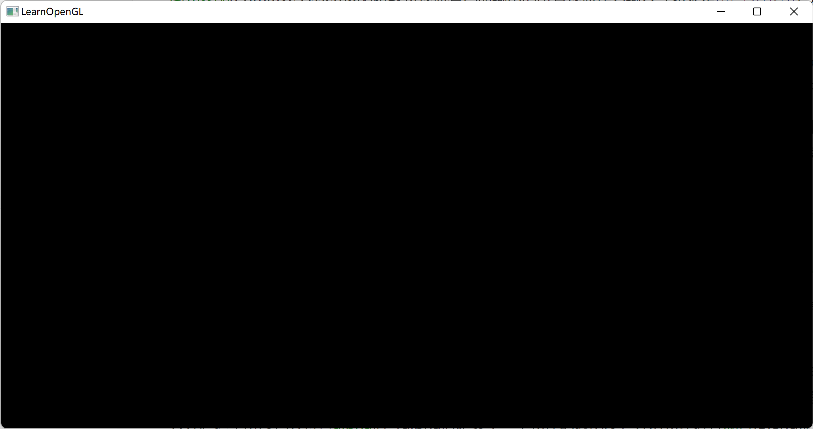
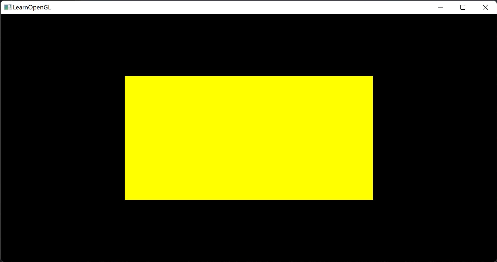
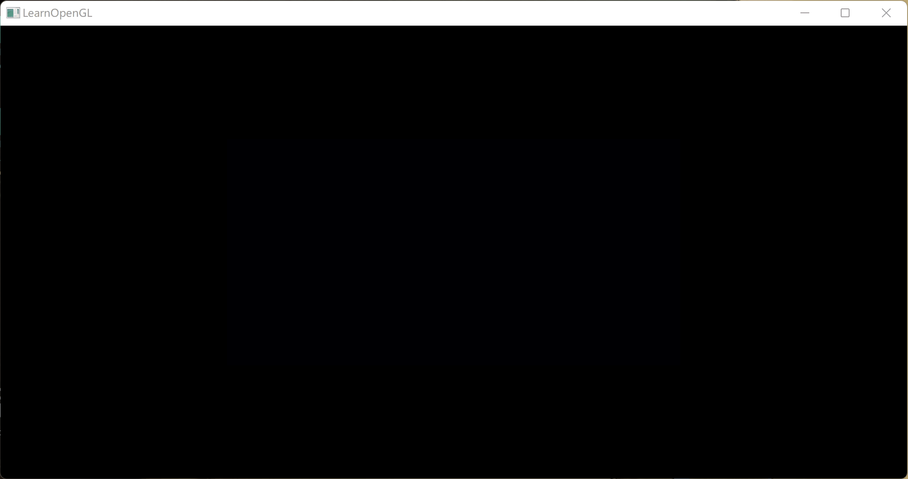
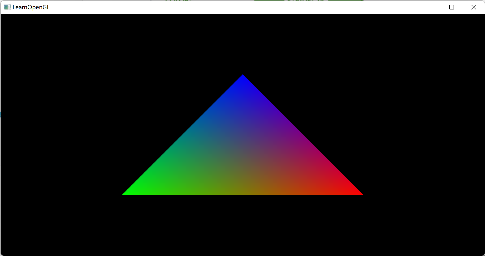
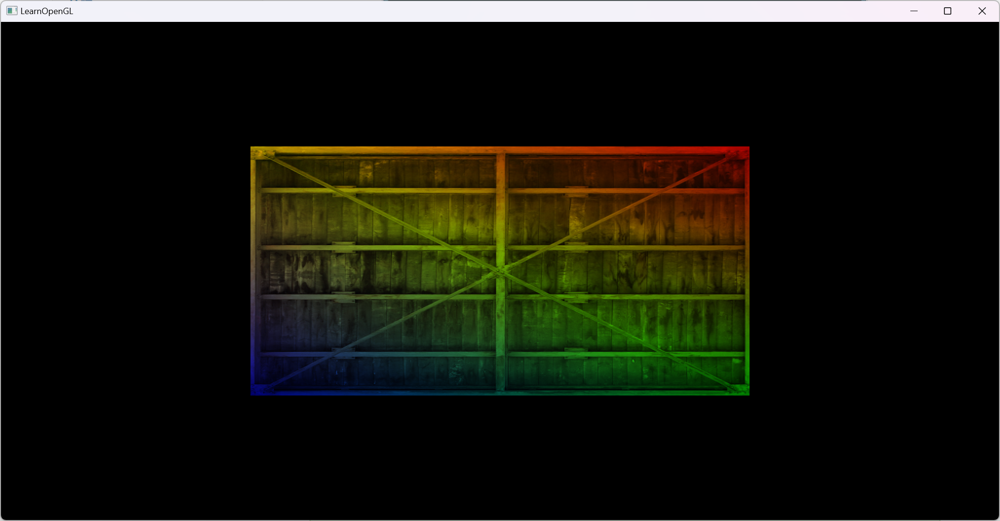
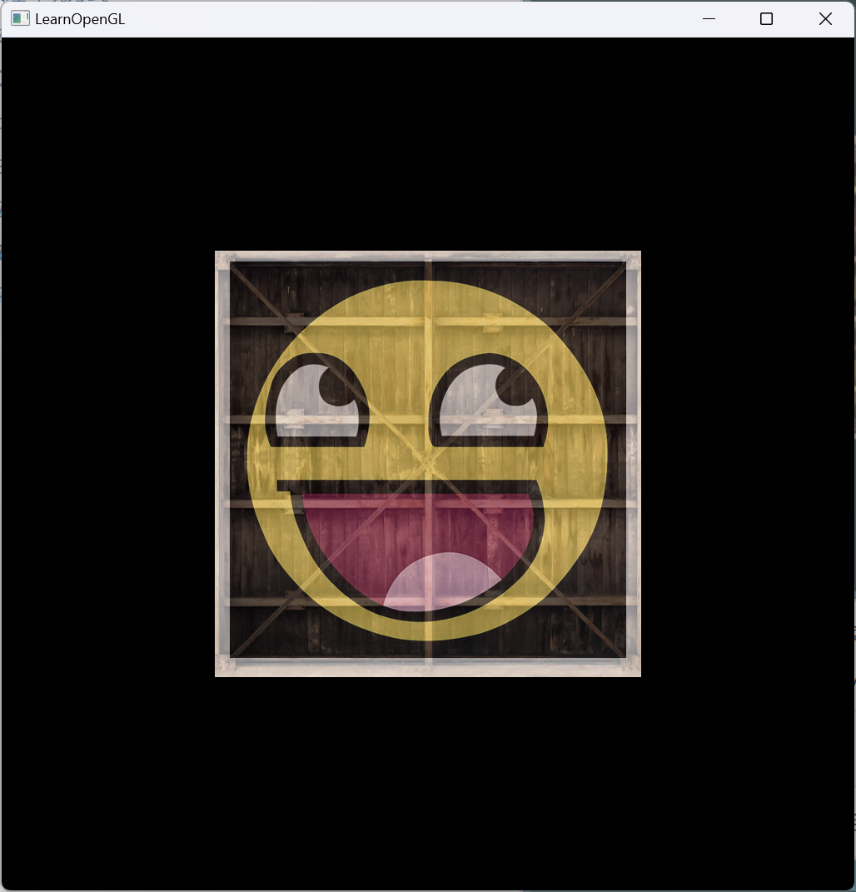
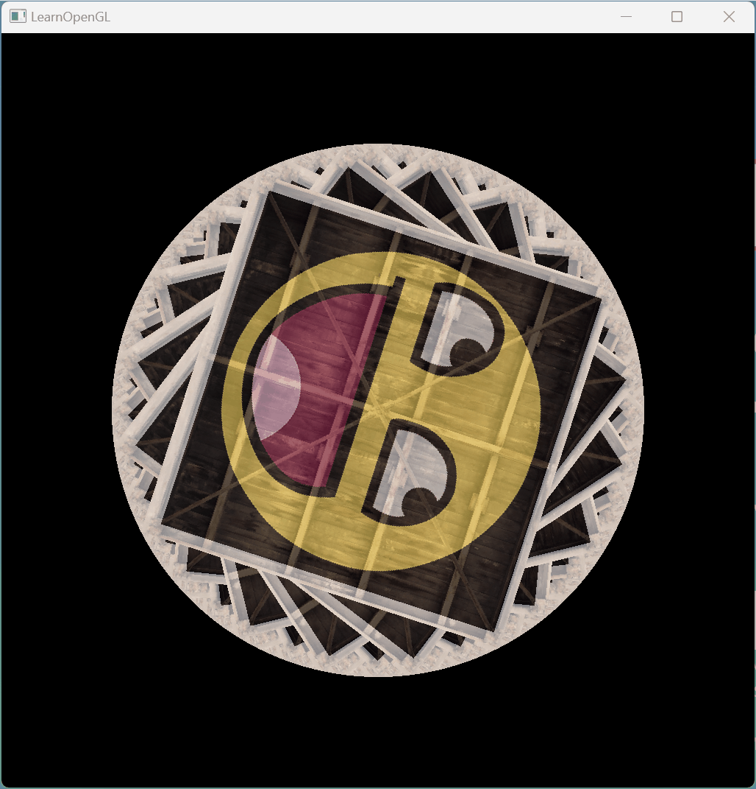
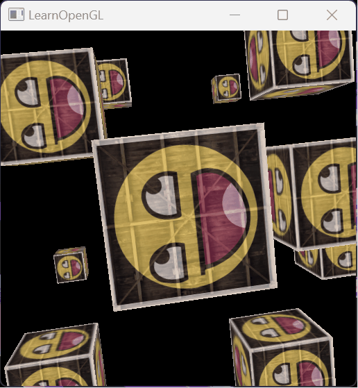

# LearningOpenGL
学习OpenGL之旅，OpenGL（Open Graphics Library）一个跨编程语言、跨平台的编程接口规格的专业的图形程序接口
## 入门
### 创建窗口
初始化GLFW（Graphics Library Framework），一个小型 C 库，允许使用 OpenGL 上下文创建和管理窗口，也可以使用多个监视器和视频模式，同时提供对键盘、鼠标和操纵杆输入的访问  
初始化GLAD，GLAD管理 OpenGL 的函数指针，需要在调用任何 OpenGL 函数之前初始化 GLAD，向 GLAD 传递函数以加载特定于操作系统的 OpenGL 函数指针的地址  
设置 OpenGL 渲染窗口的大小

### 三角形
标准化设备坐标(Normalized Device Coordinates, NDC)：[-1,1]³  
视口变换(Viewport Transform)：标准化设备坐标(Normalized Device Coordinates)会变换为屏幕空间坐标(Screen-space Coordinates)  
顶点缓冲对象(Vertex Buffer Objects, VBO)管理存储顶点数据的内存  
顶点数组对象（Vertex Array Object，VAO）管理顶点数据，存储顶点数组所需的状态信息

### 矩形
元素缓冲对象(Element Buffer Object，EBO)，也叫索引缓冲对象(Index Buffer Object，IBO)存储 OpenGL 用来决定要绘制哪些顶点的索引

### 着色器
向量重组：可以使用4个字母任意组合来创建一个和原来向量一样长的（同类型）新向量
```c++
vec2 someVec;
vec4 differentVec = someVec.xyxx;
vec3 anotherVec = differentVec.zyw;
vec4 otherVec = someVec.xxxx + anotherVec.yxzy;
```
uniform全局变量

会自动插值

编写一个着色器类
```c++
class Shader {
public:
    // 程序ID
    unsigned int ID;
    // 构造器读取并构建着色器
    Shader(const char *vertexPath, const char *fragmentPath);
    // 使用/激活程序
    void use();
    // uniform工具函数
    void setBool(const std::string &name, bool value) const;
    void setInt(const std::string &name, int value) const;
    void setFloat(const std::string &name, float value) const;
};
```
### 纹理
纹理环绕方式：当纹理坐标超过范围的处理方式  
纹理过滤：线性插值和邻近过滤  
缩小：多级渐远纹理，mipmap  
顶点着色器
```c++
#version 330 core
layout (location = 0) in vec3 aPos;
layout (location = 1) in vec3 aColor;
layout (location = 2) in vec2 aTexCoord;

out vec3 ourColor;
out vec2 TexCoord;

void main()
{
    gl_Position = vec4(aPos, 1.0);
    ourColor = aColor;
    TexCoord = aTexCoord;
}
```
片源着色器
```c++
#version 330 core
out vec4 FragColor;

in vec3 ourColor;
in vec2 TexCoord;

uniform sampler2D ourTexture;

void main()
{
    FragColor = texture(ourTexture, TexCoord)*vec4(ourColor,1.0);
}
```

#### 纹理单元
一张纹理的索引  
顶点着色器：mix函数需要接受两个值作为参数，并对它们根据第三个参数进行线性插值。如果第三个值是0.0，它会返回第一个输入；如果是1.0，会返回第二个输入值。0.2会返回80%的第一个输入颜色和20%的第二个输入颜色，即返回两个纹理的混合色
```c++
uniform sampler2D texture1;
uniform sampler2D texture2;

void main()
{
    FragColor = mix(texture(texture1, TexCoord), texture(texture2, TexCoord), 0.5);
}
```

### 矩阵变化
顶点着色器
```c++
#version 330 core
layout (location = 0) in vec3 aPos;
layout (location = 1) in vec3 aColor;
layout (location = 2) in vec2 aTexCoord;

out vec3 ourColor;
out vec2 TexCoord;
uniform mat4 transform;
void main()
{
    gl_Position = transform*vec4(aPos, 1.0);
    ourColor = aColor;
    TexCoord = aTexCoord;
}
```

### 坐标系统
局部坐标→世界坐标→观察坐标→裁剪坐标→屏幕坐标

#### 局部空间(Local Space，或者称为物体空间(Object Space))
模型所有顶点的相对空间中的局部坐标
#### 世界空间(World Space)
模型变换将局部坐标变换到世界坐标，即把模型放到场景中
#### 观察空间(View Space，或者称为视觉空间(Eye Space))
也称为摄像机空间，即从摄像机的视角所观察到的空间，通过观察变换将世界坐标变换到摄像机空间
#### 裁剪空间(Clip Space)
只展示某个范围空间内的东西，并将它们的坐标变换到[-1,1]中，通过正交投影和透视投影实现
##### 正交投影
前两个参数指定了平截头体的左右坐标，第三和第四参数指定了平截头体的底部和顶部。通过这四个参数我们定义了近平面和远平面的大小，然后第五和第六个参数则定义了近平面和远平面的距离。这个投影矩阵会将处于这些x，y，z值范围内的坐标变换为标准化设备坐标
```c++
glm::ortho(0.0f, 800.0f, 0.0f, 600.0f, 0.1f, 100.0f);
```
##### 透视投影
第一个参数定义了fov的值，它表示的是视野(Field of View)，并且设置了观察空间的大小。如果想要一个真实的观察效果，它的值通常设置为45.0f，但想要一个末日风格的结果你可以将其设置一个更大的值。第二个参数设置了宽高比，由视口的宽除以高所得。第三和第四个参数设置了平截头体的近和远平面。我们通常设置近距离为0.1f，而远距离设为100.0f。所有在近平面和远平面内且处于平截头体内的顶点都会被渲染
```c++
glm::mat4 proj = glm::perspective(glm::radians(45.0f), (float)width/(float)height, 0.1f, 100.0f);
```
#### 屏幕空间(Screen Space)
OpenGL会使用glViewPort内部的参数来将标准化设备坐标映射到屏幕坐标，每个坐标都关联了一个屏幕上的点，这个过程称为视口变换  
顶点着色器
```c++
#version 330 core
layout (location = 0) in vec3 aPos;
layout (location = 1) in vec2 aTexCoord;

out vec2 TexCoord;
uniform mat4 transform;

void main()
{
    gl_Position = transform *vec4(aPos, 1.0);
    TexCoord = aTexCoord;
}
```
mvp变换+深度缓冲
```c++
    glm::mat4 view;
    view = glm::translate(view, glm::vec3(0, 0, -3.f));
    glm::mat4 projection;
    projection = glm::perspective(glm::radians(45.0f), 1.f, 0.1f, 100.0f);
    glEnable(GL_DEPTH_TEST); // 深度缓存
    while (!glfwWindowShouldClose(mainWindow)) {
        glClear(GL_COLOR_BUFFER_BIT | GL_DEPTH_BUFFER_BIT); // 清除深度缓存
        shader.use();
        glActiveTexture(GL_TEXTURE0);
        glBindTexture(GL_TEXTURE_2D, texture1);
        glActiveTexture(GL_TEXTURE1);
        glBindTexture(GL_TEXTURE_2D, texture2);
        glBindVertexArray(VAO);
        for (auto cubePosition: cubePositions) {
            glm::mat4 model;
            model = glm::translate(model, cubePosition);
            model = glm::rotate(model, (float) glfwGetTime() * glm::radians(45.0f), glm::vec3(1.0f, 1.0f, 1.0f));
            glm::mat4 transform = projection * view * model;
            int transformLoc = glGetUniformLocation(shader.ID, "transform");
            glUniformMatrix4fv(transformLoc, 1, GL_FALSE, glm::value_ptr(transform));
            glDrawArrays(GL_TRIANGLES, 0, 36);
        }
        glfwSwapBuffers(mainWindow); // 交换在此渲染迭代期间用于渲染的颜色缓冲区
        glfwPollEvents(); // 检查是否触发了任何事件（如键盘输入或鼠标移动事件）
    }
```

### 摄像机
#### LookAt矩阵
```c++
glm::mat4 view;
view = glm::lookAt(glm::vec3(0.0f, 0.0f, 3.0f), // 摄像机位置
           glm::vec3(0.0f, 0.0f, 0.0f),         // 看向目标的位置
           glm::vec3(0.0f, 1.0f, 0.0f));        // up向量
```
处理输入事件
```c++
void processInput(GLFWwindow *window) {
    if (glfwGetKey(window, GLFW_KEY_ESCAPE) == GLFW_PRESS)
        glfwSetWindowShouldClose(window, true);
    auto cameraSpeed = static_cast<float> (16 * deltaTime);
    if (glfwGetKey(window, GLFW_KEY_W) == GLFW_PRESS)
        cameraPosition += cameraSpeed * cameraFront;
    if (glfwGetKey(window, GLFW_KEY_S) == GLFW_PRESS)
        cameraPosition -= cameraSpeed * cameraFront;
    if (glfwGetKey(window, GLFW_KEY_A) == GLFW_PRESS)
        cameraPosition -= glm::normalize(glm::cross(cameraFront, cameraUp)) * cameraSpeed;
    if (glfwGetKey(window, GLFW_KEY_D) == GLFW_PRESS)
        cameraPosition += glm::normalize(glm::cross(cameraFront, cameraUp)) * cameraSpeed;
}
```

#### 欧拉角
捕捉光标，监听鼠标移动事件
```c++
    glfwSetInputMode(mainWindow, GLFW_CURSOR, GLFW_CURSOR_DISABLED); // 捕捉光标
    glfwSetCursorPosCallback(mainWindow, mouse_callback); // 监听鼠标移动事件
```
根据鼠标上下左右移动计算俯仰角和偏航角，鼠标位置的初始值设置为屏幕的中心
```c++
bool firstMouse = true;
float lastX=256, lastY=256, yaw = 0, pitch = 0;
void mouse_callback(GLFWwindow *window, double xpos, double ypos) {
    if (firstMouse) {
        lastX = xpos;
        lastY = ypos;
        firstMouse = false;
    }
    float xoffset = xpos - lastX;
    float yoffset = lastY - ypos;
    lastX = xpos;
    lastY = ypos;
    float sensitivity = 0.05;
    xoffset *= sensitivity;
    yoffset *= sensitivity;
    yaw += xoffset;
    pitch += yoffset;
    if (pitch > 89.0f)
        pitch = 89.0f;
    if (pitch < -89.0f)
        pitch = -89.0f;
    glm::vec3 front;
    front.x = cos(glm::radians(yaw)) * cos(glm::radians(pitch));
    front.y = sin(glm::radians(pitch));
    front.z = sin(glm::radians(yaw)) * cos(glm::radians(pitch));
    cameraFront = glm::normalize(front);
}
```
#### 鼠标缩放
注册鼠标滚轮的回调函数
```c++
glfwSetScrollCallback(window, scroll_callback);
```
yoffset值代表竖直滚动的大小，改变视角fov大小，把缩放级别(Zoom Level)限制在1.0f到45.0f
```c++
void scroll_callback(GLFWwindow *window, double xoffset, double yoffset) {
    if (fov >= 1.0f && fov <= 45.0f)
        fov -= yoffset;
    if (fov <= 1.0f)
        fov = 1.0f;
    if (fov >= 45.0f)
        fov = 45.0f;
}
```

### 复习
#### OpenGL
一个定义了函数布局和输出的图形API的正式规范。
#### GLAD
一个扩展加载库，用来为我们加载并设定所有OpenGL函数指针，从而让我们能够使用所有（现代）OpenGL函数。
#### 视口(Viewport)
我们需要渲染的窗口。
#### 图形管线(Graphics Pipeline)
一个顶点在呈现为像素之前经过的全部过程。
#### 着色器(Shader)
一个运行在显卡上的小型程序。很多阶段的图形管道都可以使用自定义的着色器来代替原有的功能。
#### 标准化设备坐标(Normalized Device Coordinates, NDC)
顶点在通过在剪裁坐标系中剪裁与透视除法后最终呈现在的坐标系。所有位置在NDC下-1.0到1.0的顶点将不会被丢弃并且可见。
#### 顶点缓冲对象(Vertex Buffer Object)
一个调用显存并存储所有顶点数据供显卡使用的缓冲对象。
#### 顶点数组对象(Vertex Array Object)
存储缓冲区和顶点属性状态。
#### 元素缓冲对象(Element Buffer Object，EBO)，也叫索引缓冲对象(Index Buffer Object，IBO)
一个存储元素索引供索引化绘制使用的缓冲对象。
#### Uniform
一个特殊类型的GLSL变量。它是全局的（在一个着色器程序中每一个着色器都能够访问uniform变量），并且只需要被设定一次。
#### 纹理(Texture)
一种包裹着物体的特殊类型图像，给物体精细的视觉效果。
#### 纹理环绕(Texture Wrapping)
定义了一种当纹理顶点超出范围(0, 1)时指定OpenGL如何采样纹理的模式。
#### 纹理过滤(Texture Filtering)
定义了一种当有多种纹素选择时指定OpenGL如何采样纹理的模式。这通常在纹理被放大情况下发生。
#### 多级渐远纹理(Mipmaps)
被存储的材质的一些缩小版本，根据距观察者的距离会使用材质的合适大小。
#### stb_image.h
图像加载库。
#### 纹理单元(Texture Units)
通过绑定纹理到不同纹理单元从而允许多个纹理在同一对象上渲染。
#### 向量(Vector)
一个定义了在空间中方向和/或位置的数学实体。
#### 矩阵(Matrix)
一个矩形阵列的数学表达式。
#### GLM
一个为OpenGL打造的数学库。
#### 局部空间(Local Space)
一个物体的初始空间。所有的坐标都是相对于物体的原点的。
#### 世界空间(World Space)
所有的坐标都相对于全局原点。
#### 观察空间(View Space)
所有的坐标都是从摄像机的视角观察的。
#### 裁剪空间(Clip Space)
所有的坐标都是从摄像机视角观察的，但是该空间应用了投影。这个空间应该是一个顶点坐标最终的空间，作为顶点着色器的输出。OpenGL负责处理剩下的事情（裁剪/透视除法）。
#### 屏幕空间(Screen Space)
所有的坐标都由屏幕视角来观察。坐标的范围是从0到屏幕的宽/高。
#### LookAt矩阵
一种特殊类型的观察矩阵，它创建了一个坐标系，其中所有坐标都根据从一个位置正在观察目标的用户旋转或者平移。
#### 欧拉角(Euler Angles)
被定义为偏航角(Yaw)，俯仰角(Pitch)，和滚转角(Roll)从而允许我们通过这三个值构造任何3D方向。