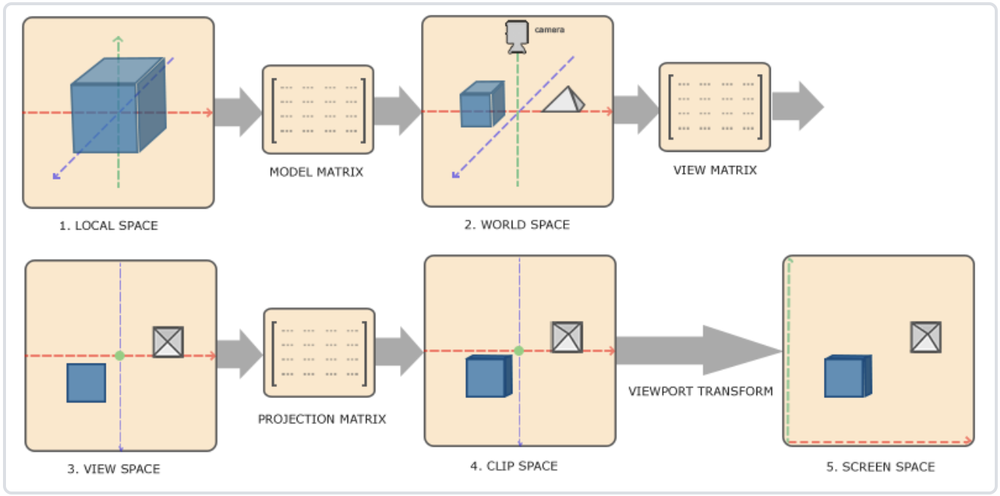

# LearningOpenGL
学习OpenGL之旅，OpenGL（Open Graphics Library）一个跨编程语言、跨平台的编程接口规格的专业的图形程序接口
## 入门
### 创建窗口
初始化GLFW（Graphics Library Framework），一个小型 C 库，允许使用 OpenGL 上下文创建和管理窗口，也可以使用多个监视器和视频模式，同时提供对键盘、鼠标和操纵杆输入的访问  
初始化GLAD，GLAD管理 OpenGL 的函数指针，需要在调用任何 OpenGL 函数之前初始化 GLAD，向 GLAD 传递函数以加载特定于操作系统的 OpenGL 函数指针的地址  
设置 OpenGL 渲染窗口的大小

### 三角形
标准化设备坐标(Normalized Device Coordinates, NDC)：[-1,1]³  
视口变换(Viewport Transform)：标准化设备坐标(Normalized Device Coordinates)会变换为屏幕空间坐标(Screen-space Coordinates)  
顶点缓冲对象(Vertex Buffer Objects, VBO)管理存储顶点数据的内存  
顶点数组对象（Vertex Array Object，VAO）管理顶点数据，存储顶点数组所需的状态信息

### 矩形
元素缓冲对象(Element Buffer Object，EBO)，也叫索引缓冲对象(Index Buffer Object，IBO)存储 OpenGL 用来决定要绘制哪些顶点的索引

### 着色器
向量重组：可以使用4个字母任意组合来创建一个和原来向量一样长的（同类型）新向量
```c++
vec2 someVec;
vec4 differentVec = someVec.xyxx;
vec3 anotherVec = differentVec.zyw;
vec4 otherVec = someVec.xxxx + anotherVec.yxzy;
```
uniform全局变量

会自动插值

编写一个着色器类
```c++
class Shader {
public:
    // 程序ID
    unsigned int ID;
    // 构造器读取并构建着色器
    Shader(const char *vertexPath, const char *fragmentPath);
    // 使用/激活程序
    void use();
    // uniform工具函数
    void setBool(const std::string &name, bool value) const;
    void setInt(const std::string &name, int value) const;
    void setFloat(const std::string &name, float value) const;
};
```
### 纹理
纹理环绕方式：当纹理坐标超过范围的处理方式  
纹理过滤：线性插值和邻近过滤  
缩小：多级渐远纹理，mipmap  
顶点着色器
```c++
#version 330 core
layout (location = 0) in vec3 aPos;
layout (location = 1) in vec3 aColor;
layout (location = 2) in vec2 aTexCoord;

out vec3 ourColor;
out vec2 TexCoord;

void main()
{
    gl_Position = vec4(aPos, 1.0);
    ourColor = aColor;
    TexCoord = aTexCoord;
}
```
片源着色器
```c++
#version 330 core
out vec4 FragColor;

in vec3 ourColor;
in vec2 TexCoord;

uniform sampler2D ourTexture;

void main()
{
    FragColor = texture(ourTexture, TexCoord)*vec4(ourColor,1.0);
}
```

#### 纹理单元
一张纹理的索引  
顶点着色器：mix函数需要接受两个值作为参数，并对它们根据第三个参数进行线性插值。如果第三个值是0.0，它会返回第一个输入；如果是1.0，会返回第二个输入值。0.2会返回80%的第一个输入颜色和20%的第二个输入颜色，即返回两个纹理的混合色
```c++
uniform sampler2D texture1;
uniform sampler2D texture2;

void main()
{
    FragColor = mix(texture(texture1, TexCoord), texture(texture2, TexCoord), 0.5);
}
```

### 矩阵变化
顶点着色器
```c++
#version 330 core
layout (location = 0) in vec3 aPos;
layout (location = 1) in vec3 aColor;
layout (location = 2) in vec2 aTexCoord;

out vec3 ourColor;
out vec2 TexCoord;
uniform mat4 transform;
void main()
{
    gl_Position = transform*vec4(aPos, 1.0);
    ourColor = aColor;
    TexCoord = aTexCoord;
}
```

### 坐标系统
局部坐标→世界坐标→观察坐标→裁剪坐标→屏幕坐标

#### 局部空间(Local Space，或者称为物体空间(Object Space))
模型所有顶点的相对空间中的局部坐标
#### 世界空间(World Space)
模型变换将局部坐标变换到世界坐标，即把模型放到场景中
#### 观察空间(View Space，或者称为视觉空间(Eye Space))
也称为摄像机空间，即从摄像机的视角所观察到的空间，通过观察变换将世界坐标变换到摄像机空间
#### 裁剪空间(Clip Space)
只展示某个范围空间内的东西，并将它们的坐标变换到[-1,1]中，通过正交投影和透视投影实现
##### 正交投影
前两个参数指定了平截头体的左右坐标，第三和第四参数指定了平截头体的底部和顶部。通过这四个参数我们定义了近平面和远平面的大小，然后第五和第六个参数则定义了近平面和远平面的距离。这个投影矩阵会将处于这些x，y，z值范围内的坐标变换为标准化设备坐标
```c++
glm::ortho(0.0f, 800.0f, 0.0f, 600.0f, 0.1f, 100.0f);
```
##### 透视投影
第一个参数定义了fov的值，它表示的是视野(Field of View)，并且设置了观察空间的大小。如果想要一个真实的观察效果，它的值通常设置为45.0f，但想要一个末日风格的结果你可以将其设置一个更大的值。第二个参数设置了宽高比，由视口的宽除以高所得。第三和第四个参数设置了平截头体的近和远平面。我们通常设置近距离为0.1f，而远距离设为100.0f。所有在近平面和远平面内且处于平截头体内的顶点都会被渲染
```c++
glm::mat4 proj = glm::perspective(glm::radians(45.0f), (float)width/(float)height, 0.1f, 100.0f);
```
#### 屏幕空间(Screen Space)
OpenGL会使用glViewPort内部的参数来将标准化设备坐标映射到屏幕坐标，每个坐标都关联了一个屏幕上的点，这个过程称为视口变换