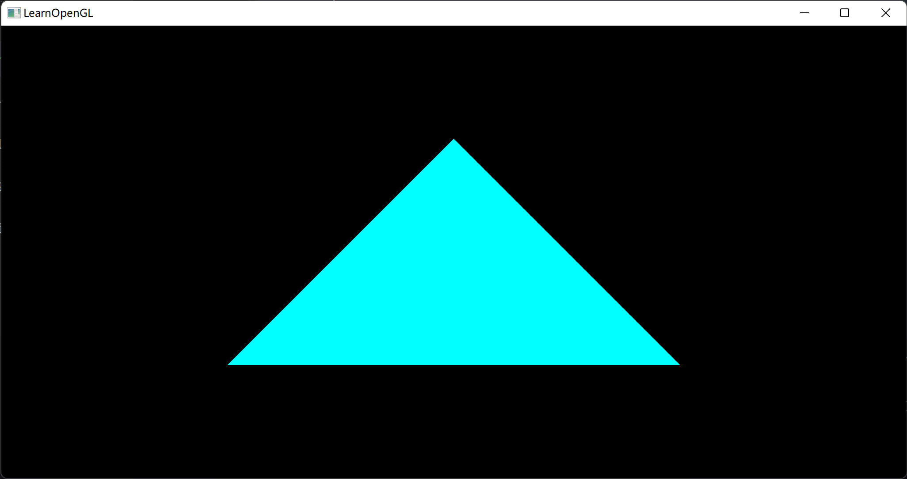

# LearningOpenGL
学习OpenGL之旅，OpenGL（Open Graphics Library）一个跨编程语言、跨平台的编程接口规格的专业的图形程序接口
## 入门
### 创建窗口
初始化GLFW（Graphics Library Framework），一个小型 C 库，允许使用 OpenGL 上下文创建和管理窗口，也可以使用多个监视器和视频模式，同时提供对键盘、鼠标和操纵杆输入的访问  
初始化GLAD，GLAD管理 OpenGL 的函数指针，需要在调用任何 OpenGL 函数之前初始化 GLAD，向 GLAD 传递函数以加载特定于操作系统的 OpenGL 函数指针的地址  
设置 OpenGL 渲染窗口的大小

### 三角形
标准化设备坐标(Normalized Device Coordinates, NDC)：[-1,1]³  
视口变换(Viewport Transform)：标准化设备坐标(Normalized Device Coordinates)会变换为屏幕空间坐标(Screen-space Coordinates)  
顶点缓冲对象(Vertex Buffer Objects, VBO)管理存储顶点数据的内存  
顶点数组对象（Vertex Array Object，VAO）管理顶点数据，存储顶点数组所需的状态信息

### 矩形
元素缓冲对象(Element Buffer Object，EBO)，也叫索引缓冲对象(Index Buffer Object，IBO)存储 OpenGL 用来决定要绘制哪些顶点的索引

### 着色器
向量重组：可以使用4个字母任意组合来创建一个和原来向量一样长的（同类型）新向量
```c++
vec2 someVec;
vec4 differentVec = someVec.xyxx;
vec3 anotherVec = differentVec.zyw;
vec4 otherVec = someVec.xxxx + anotherVec.yxzy;
```
uniform全局变量

会自动插值

编写一个着色器类
```c++
class Shader {
public:
    // 程序ID
    unsigned int ID;
    // 构造器读取并构建着色器
    Shader(const char *vertexPath, const char *fragmentPath);
    // 使用/激活程序
    void use();
    // uniform工具函数
    void setBool(const std::string &name, bool value) const;
    void setInt(const std::string &name, int value) const;
    void setFloat(const std::string &name, float value) const;
};
```